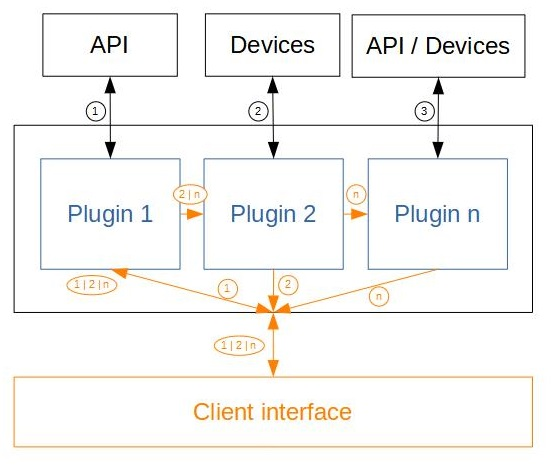

# node-pluginsmanager
A plugins manager

[](https://travis-ci.org/Psychopoulet/node-pluginsmanager)
[](https://coveralls.io/github/Psychopoulet/node-pluginsmanager)
[](https://david-dm.org/Psychopoulet/node-pluginsmanager)
[](https://david-dm.org/Psychopoulet/node-pluginsmanager?type=dev)
[](https://github.com/Psychopoulet/node-pluginsmanager/issues)
[](https://github.com/Psychopoulet/node-pluginsmanager/pulls)

> please note that this version is only usable with node-pluginsmanager-plugin 3.x.x &&  4.x.x

## Installation

```bash
$ npm install node-pluginsmanager
```

## Features

  * simply manage plugins (extended from [node-pluginsmanager-plugin](https://github.com/Psychopoulet/node-pluginsmanager-plugin)) to interact with specifics hardwares / API / whatever
  * install plugins manually or via github & initialize them
  * update plugins via github
  * uninstall plugins and release there resources
  * run plugins' middlewares for server, to create specifics rules
  * check plugins' modules' versions

## Architecture

### Plugin


### Routes



## Content

[check the TypeScript definition file](https://github.com/Psychopoulet/node-pluginsmanager/blob/master/lib/index.d.ts)

## Events

  * ``` on("error", (err: Error) => void) : this ``` fires if an error occurs

  * ``` on("loading", (plugin: Orchestrator, data?: any) => void) : this ``` fires if a plugin starts load
  * ``` on("loaded", (plugin: Orchestrator, data?: any) => void) : this ``` fires if a plugin ends load
  * ``` on("allloaded", (data?: any) => void) : this ``` fires if all the plugins are loaded

  * ``` on("initializing", (plugin: Orchestrator, data?: any) => void) : this ``` fires if a plugin starts init
  * ``` on("initialized", (plugin: Orchestrator, data?: any) => void) : this ``` fires if a plugin ends init
  * ``` on("allinitialized", (data?: any) => void) : this ``` fires if all the plugins are initialized

  * ``` on("released", (plugin: Orchestrator, data?: any) => void) : this ``` fires if a plugin is released
  * ``` on("allreleased", (data?: any) => void) : this ``` fires if all the plugins are released

  * ``` on("destroyed", (pluginName: string, data?: any) => void) : this ``` fires if a plugin is destroyed
  * ``` on("alldestroyed", (data?: any) => void) : this ``` fires if all the plugins are destroyed

  * ``` on("installed", (pluginName: string, data?: any) => void) : this ``` fires if a plugin is installed
  * ``` on("updated", (plugin: Orchestrator, data?: any) => void) : this ``` fires if a plugin is updated
  * ``` on("uninstalled", (pluginName: string, data?: any) => void) : this ``` fires if a plugin is uninstalled

## Examples

[check the TypeScript compilation tests](https://github.com/Psychopoulet/node-pluginsmanager/blob/master/test/typescript/compilation.ts)

## Tests

```bash
$ git clone git://github.com/Psychopoulet/node-pluginsmanager.git
$ cd ./node-pluginsmanager
$ npm install
$ npm run-script tests
```

## License

  [ISC](LICENSE)
